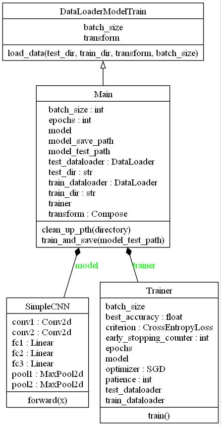

# GenderRecognition CI/CD-Pipline

Dieses Projekt ist eine CI/CD-Pipline für ein GenderRecognition-Modell, das das Geschlecht einer Person anhand eines Gesichtsbildes erkennen kann. Das Modell wurde mit dem Datensatz CelebA trainiert, der über 200.000 Bilder von Prominenten mit verschiedenen Attributen enthält, darunter auch das Geschlecht. Das Modell ist ein Convolutional Neural Network (CNN), das mit Tensorflow implementiert wurde. Die Pipline verwendet GithubActions, um das Modell automatisch zu testen, zu bauen und zu deployen.

## Anforderungen

Um dieses Projekt auszuführen, benötigst du:

- Python 3.8 oder höher
- Tensoflow 1.9.0 oder höher
- Keras am besten aktuelles Version
- matplotlib
- seaborn
- Numpy 1.21.0 oder höher
- PIL 8.2.0 oder höher
- Pandas am besten aktuellste Version
- Github Account
- Github Personal Access Token
- GitHub Pro falls deine Tests die 2000 minuten Github Actions Serverzeit überschreiten
- ggf. einen eignen Testserver um Github Actions ohne zeitliche Limitierung verwenden zu können

## Installation

Um dieses Projekt zu installieren, folge diesen Schritten:

- Klone dieses Repository auf deinen lokalen Rechner oder forke es auf Github.
- Erstelle eine virtuelle Umgebung mit Python 3.8 oder höher und aktiviere sie.
- Installiere die erforderlichen Pakete mit dem Befehl `pip install -r requirements.txt`.
- Erstelle eine Datei namens `.env` im Projektverzeichnis und füge deinen Github Personal Access Token als Umgebungsvariable hinzu, z.B. `GITHUB_TOKEN=xxxxxxxxxxxxxxxxxxxxxxxxxxxxxxxxxxxxxxxx`.
- Erstelle eine Datei namens `.github/workflows/cicd.yml` im Projektverzeichnis und füge den folgenden Inhalt hinzu:

# Der Workflow

# Klassendiagramme der Python-Skripte

# UML-Datenaufbereitungsskript

# UML-Trainingsskript

# UML-Testskript

# UML-Deployskript

