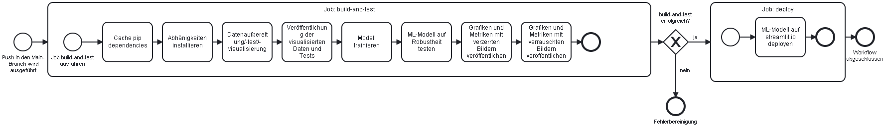
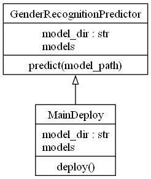

# GenderRecognition CI/CD-Pipline

Dieses Projekt ist eine CI/CD-Pipline für ein GenderRecognition-Modell, das das Geschlecht einer Person anhand eines Gesichtsbildes erkennen kann. Das Modell wurde mit dem Datensatz CelebA trainiert, der über 200.000 Bilder von Prominenten mit verschiedenen Attributen enthält, darunter auch das Geschlecht. Das Modell ist ein Convolutional Neural Network (CNN), das mit Tensorflow implementiert wurde. Die Pipline verwendet GithubActions, um das Modell automatisch zu testen, zu bauen und zu deployen.

## Anforderungen
Um dieses Projekt selbst verwenden zu können, benötigst du folgende Bibliotheken:
- fairlearn
- matplotlib
- numpy
- openpyxl
- pandas
- psutil
- pydqc
- pytest
- radon
- scikit-image
- scikit-learn
- scipy
- seaborn
- tqdm
- torch
- torchvision
- torchcam

Des Weiteren benötigst du:
- einen Github Account
- Github Personal Access Token
- GitHub Pro falls deine Tests die 2000 minuten Github Actions Serverzeit überschreiten
- ggf. einen eignen Testserver um Github Actions ohne zeitliche Limitierung verwenden zu können

## Installation
Um dieses Projekt zu installieren, folge diesen Schritten:
- Klone dieses Repository auf deinen lokalen Rechner oder forke es auf Github.
- Erstelle eine virtuelle Umgebung mit Python 3.8 oder höher und aktiviere sie.
- Installiere die erforderlichen Pakete mit dem Befehl `pip install -r requirements.txt`.
- Erstelle eine Workflowdatei z. B. `.github/workflows/cicd.yml` im Projektverzeichnis un

# Der Workflow
Der Workflow wird in der folgenden Grafik kompakt dargestellt, um einen Überblick über die relevanten Schritte zu erhalten. 

# Klassendiagramme der Python-Skripte

# UML-Datenaufbereitungsskript

# UML-Trainingsskript
Hier ist das Trainingsskript zusehen, welches dafür da ist das Modell zu trainieren. Durch einen Klick auf das Bild, kannst du das Bild direkt vergrößern lassen und unter folgenden Link kannst du die Dokumentation zu diesem Skript sehen.

# UML-Testskript

# UML-Deployskript

